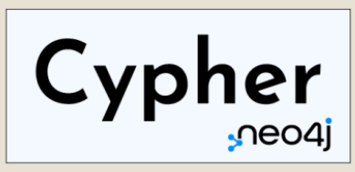
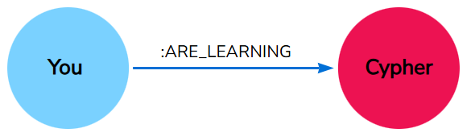

# CYPHER

**Bhagyasha Patil**  
**LOD_WS24**  
**29/10/2024**

# Introduction

- **Problem Statement**: Linked Open Data connects diverse data sources but presents complex querying challenges.
- **Challenge**: Traditional databases (SQL) struggle with LOD’s interconnected structure.
- **Goal**: We need a flexible, graph-based query language designed to handle these complexities.


# What is Cypher?
- **Cypher** is Neo4j’s declarative graph query language
- Allows users to focus on *what* to retrieve from the graph, rather than *how* to retrieve it.
- Optimized for querying complex data relationships, helps users realize the full potential of property graph databases.
-  


# Cypher’s Visual Syntax
- Uses ASCII-art-like syntax for representing nodes and relationships:
  - **Example**: `(nodes)-[:CONNECT_TO]->(otherNodes)`
  - **Notation**: Rounded brackets for circular nodes, `-[:ARROWS]->` for relationships.
  -  
  - (You)-[:ARE_LEARNING]->(Cypher)
- Writing a Cypher query resembles drawing patterns in data, which makes Cypher highly intuitive and easy to read.


# Cypher and SQL: Key Differences [1]
**Cypher** and **SQL** share some similarities but have important differences:

1. **Schema Flexibility**:
   - Cypher and Neo4j offer greater schema flexibility than SQL, allowing nodes and relationships to exist without enforcing a fixed schema.
   - Example: Cypher enables users to add new attributes and relationships as graphs evolve, without requiring all nodes or relationships to have the same properties.

# Cypher and SQL: Key Differences [2]
2. **Query Order**:
   - SQL queries start with the data to return, while Cypher queries end with the return clause.
   - **SQL Example**:  
     ```sql
     SELECT movie.name
     FROM movie
     WHERE movie.rating > 7
     ```
   - **Cypher Example**:
     ```cypher
     MATCH (movie:Movie)
     WHERE movie.rating > 7
     RETURN movie.title
     ```

# Cypher and SQL: Key Differences [3]
3. **Conciseness**:
   - Cypher queries are often more concise, representing complex data relationships without needing JOINs.
   - **SQL Example**:
     ```sql
     SELECT actors.name
     FROM actors
       LEFT JOIN acted_in ON acted_in.actor_id = actors.id
       LEFT JOIN movies ON movies.id = acted_in.movie_id
     WHERE movies.title = "The Matrix"
     ```
   - **Cypher Example**:
     ```cypher
     MATCH (actor:Actor)-[:ACTED_IN]->(movie:Movie {title: 'The Matrix'})
     RETURN actor.name
     ```


# How Cypher Solves LOD and Knowledge Graph Challenges
Cypher provides key features that make querying LOD and Knowledge Graphs effective:

1. **Interoperability**: Integrates data from diverse sources.
2. **Schema flexibility**: Pattern matching adapts to varied LOD data structures.
3. **In-depth querying**: Enables knowledge discovery through multi-hop graph traversals.


# Key Features of Cypher for LOD
Core features that make Cypher valuable for Knowledge Graphs:

- **Pattern Matching**: Enables finding specific structures in the graph.
- **Aggregation & Filtering**: Summarizes and refines large datasets.
- **Graph Traversals**: Discovers multi-hop relationships effortlessly.


# Real-World Example of Cypher in a Knowledge Graph

Query:
```cypher
MATCH (a:Author)-[:WROTE]->(p:Publication) RETURN a.name, p.title
```
Output?


# Future Potential of Cypher in Linked Open Data

- Part of the openCypher project for widespread use.
- Growing adoption in graph databases, enabling better LOD interoperability.
- A powerful tool for future data integration and Knowledge Graph applications.


# Thank You!

References:
- [Neo4j Cypher Query Language](https://neo4j.com/product/cypher-graph-query-language/?utm_source=GSearch&utm_medium=PaidSearch&utm_campaign=Evergreen&utm_content=EMEA-Search-SEMBrand-Evergreen-None-SEM-SEM-NonABM&utm_term=neo4j%20cypher&utm_adgroup=cypher-language&gad_source=1&gclid=Cj0KCQjwj4K5BhDYARIsAD1Ly2putN9hx8JeV7VqBUz6fami1SkABsH7QLoFfhnEBq_m4Rn_cl-NJIAaAq82EALw_wcB).

- [Query a Neo4j database using Cypher](https://neo4j.com/docs/getting-started/cypher-intro/)

- [Comparing Cypher with SQL](https://neo4j.com/docs/getting-started/cypher-intro/cypher-sql/)

- [openCypher](https://opencypher.org/)
