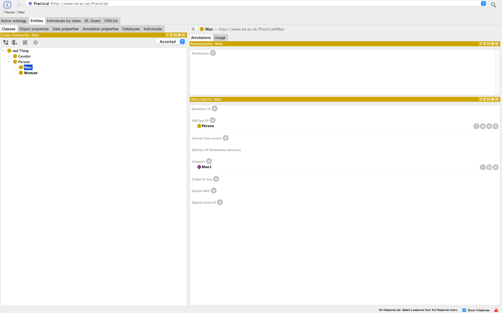

% Web Ontology Language
% Kristan Boettjer
% October 2024

# Introduction

## Problem

- Humans invented a way in which we can descibe Knowledge via Ontologies
- But how do we do it on a large scale? -> We need to make it machine Readable
- How does a machine understand the Ontologies we make? in order to -> define, query, and connect ontologies

## Solution 
- Programming Lagnuage for Ontologies
- Is the language in which Ontologies are represented and saved in order to build a knowledge Network

--- 

# Basic Information

- Currrent Version OWL 2009 (OWL2)
- Builds upon RDF and RDFS and introduces a richer **logic layer** for describing knowledge 
- **Protégé** is a popular Editor (such as PyCharm for Python) 
- OWL API (e.g. via Pyhton package *owlready2*)

---

# Basic Concepts

- **Classes**: Define categories within a domain.
- **Individuals**: Represent specific entities or instances.
- **Properties**: Specify relationships between classes or individuals.

---

# Key Features

- Data Types and Data Ranges
- Object/Datatype Properties 
- Property Chaining
- Inverse, Symmetric, Transitive, Asynmetric, Disjoint, Reflexiv, Functional, Inverse Functional Properties
- Boolean Class Operations: AND, OR, NOT
- Restrictions on Classes: Existential, Universal, Cardinality

---

# Demo

- https://knowledge-representation.org/j.z.pan/data/basic-family.owl
{ width=60% height=60% }

---

# Sources

1. https://www.w3.org/TR/2012/REC-owl2-overview-20121211/#Documentation_Roadmap
2. https://dl.acm.org/doi/10.1145/3397512

---

Thank you for attending my presentation!
